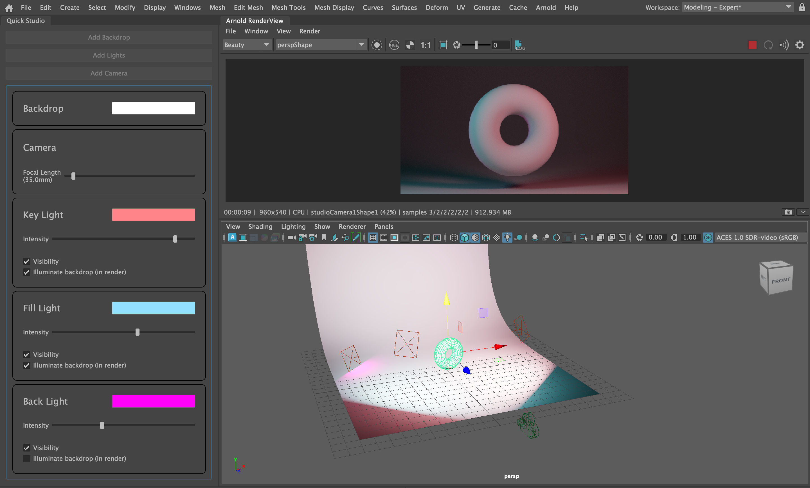

# Quick Studio Lighting

### Description

Want to quickly render your 3D model? Use this python script to quickly create a three-point lighting set-up with a studio-style backdrop in Maya.
(Requires: pymel, PySide2)

### Usage

Add this library to your scripts directory. Then open and run this in the Maya script editor.
